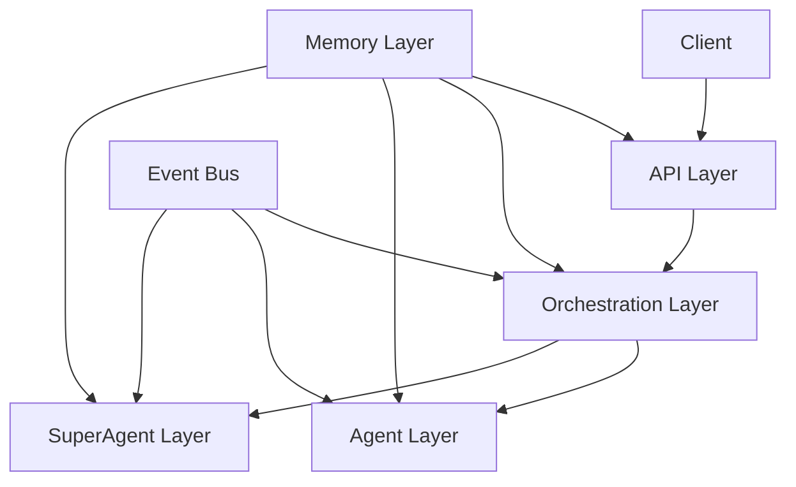

# SuperMean System Architecture

## System Overview

SuperMean is a sophisticated AI agent system designed for domain-specific problem solving through self-improving agents. The system follows a clean, layered architecture that separates concerns and promotes maintainability.

## Architectural Layers

### 1. API Layer (`/backend/api`)
The outermost layer that handles HTTP requests and provides REST endpoints.

Components:
- **Controllers**: Handle HTTP requests and responses
  - `agent_controller.py`: CRUD operations for agents
  - `mission_controller.py`: Mission management endpoints
  - `super_agent_controller.py`: SuperAgent-specific operations
  
- **Middleware**:
  - `auth_middleware.py`: Authentication and authorization
  
- **Models and Schemas**:
  - `models.py`: Database models
  - `schemas.py`: Data validation schemas

### 2. Orchestration Layer (`/backend/orchestrator`)
Manages the coordination and communication between different components.

Components:
- **Agent Orchestrator** (`agent_orchestrator.py`):
  - Manages agent lifecycle
  - Handles inter-agent communication
  - Coordinates task execution
  - Manages agent state and memory

- **Mission Control** (`mission_control.py`):
  - Manages mission lifecycle
  - Coordinates between planner, builder, and evaluator
  - Handles event publication
  - Manages mission state

- **Event Bus** (`event_bus.py`):
  - Handles system-wide event communication
  - Enables loose coupling between components

### 3. Agent Layer (`/backend/agents`)
Contains the implementation of different specialized agents.

Components:
- `base_agent.py`: Base agent class
- Specialized agents:
  - `design_agent.py`
  - `dev_agent.py`
  - `medical_agent.py`
  - `research_agent.py`

### 4. Memory Layer (`/backend/memory`)
Handles persistence and state management.

Components:
- `base_memory.py`: Base memory interface
- `agent_memory.py`: Agent-specific memory
- `global_memory.py`: System-wide shared memory
- `vector_memory.py`: Vector-based memory storage

### 5. SuperAgent Layer (`/backend/super_agent`)
Core components for the meta-agent system.

Components:
- `planner.py`: Task planning
- `builder.py`: Plan execution
- `evaluator.py`: Result evaluation
- `meta_planner.py`: Meta-level planning
- `tool_creator.py`: Dynamic tool creation

## Data Flow

1. Client Request → API Layer
2. API Layer → Orchestration Layer
3. Orchestration Layer → Agents/SuperAgent
4. Memory Layer ↔ All Layers

## Key Design Decisions

1. **Separation of Concerns**:
   - API layer focuses on HTTP interface
   - Orchestration layer handles coordination
   - Agent layer contains business logic
   - Memory layer manages state

2. **Event-Driven Architecture**:
   - Components communicate through events
   - Loose coupling between layers
   - Scalable and maintainable

3. **Memory Management**:
   - Hierarchical memory system
   - Shared and private memory spaces
   - Vector-based storage for efficient retrieval

4. **Error Handling**:
   - Each layer has specific error types
   - Proper error propagation
   - Detailed logging

## Component Relationships

## Development Guidelines

1. **API Layer**:
   - Use FastAPI decorators for endpoints
   - Implement proper validation
   - Handle HTTP-specific concerns only

2. **Orchestration Layer**:
   - Focus on coordination logic
   - Use event bus for communication
   - Maintain clean separation from API

3. **Agent Layer**:
   - Inherit from BaseAgent
   - Implement required interfaces
   - Focus on specific domain logic

4. **Memory Layer**:
   - Use appropriate memory type
   - Implement proper persistence
   - Handle concurrent access

## Testing Strategy

1. **Unit Tests**:
   - Test individual components
   - Mock dependencies
   - Focus on business logic

2. **Integration Tests**:
   - Test layer interactions
   - Verify event flow
   - Test memory operations

3. **End-to-End Tests**:
   - Test complete workflows
   - Verify system behavior
   - Test error scenarios
