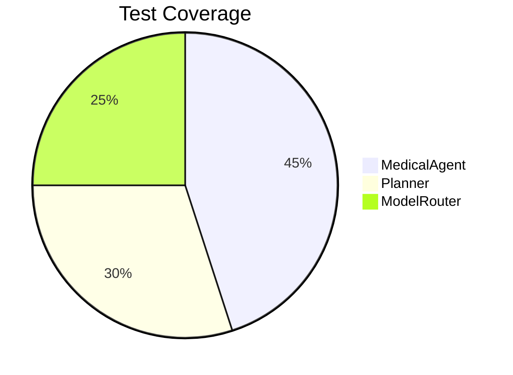

# SuperMean Implementation Status Report

## System Overview
A self-improving AI agent system for domain-specific problem solving

## Current Phase Implementation
```
[✓] Phase 1: Core Bootstrapping
[ ] Phase 2: SuperAgent Engine (Timeline: Q3 2024 | Dependencies: Phase 1)
[ ] Phase 3: Agent Framework (Timeline: Q4 2024 | Dependencies: Phase 2)
[ ] Phase 4: Skill Library (Timeline: Q1 2025 | Dependencies: Phase 3)
[ ] Phase 5: Task Orchestration (Timeline: Q2 2025 | Dependencies: Phase 4)
[ ] Phase 6: Healthcare Field Test (Timeline: Q3 2025 | Dependencies: Phase 5)
[ ] Phase 7: Interfaces (Timeline: Q4 2025 | Dependencies: Phase 6)
[ ] Phase 8: Optimization (Timeline: Q1 2026 | Dependencies: All Phases)
```

## Operational Components
- **Active Modules**: MedicalAgent, ModelRouter, Planner
- **Verified Skills**: Web Search, Text Summarization
- **Memory Systems**: VectorMemory (Faiss-based)

## Feature Implementation Tracker
| Feature | Version | Status | Owner | Target Release |
|---------|---------|--------|-------|----------------|
| Multi-agent orchestration | 1.3.0 | 15% | Core Team | Q4 2024 | Roadmap v2
| Dynamic skill loading | 1.2.1 | 40% | DevOps | Q3 2024 | Roadmap v1
| Automated evaluation loops | 1.4.0 | 5% | Research Team | Q1 2025 | Roadmap v3

## Known Limitations
1. ~~Concurrent agent execution limited to 5 parallel processes~~ (Scheduled: Q4 2024)
2. Model routing lacks fallback mechanisms (In Progress)
3. Memory system only supports English content (Planned: Q2 2025)

## Recommended Features
| Priority | Feature | Complexity | Estimated Value |
|----------|---------|------------|-----------------|
| P0 | Fault-tolerant model routing | High | Critical |
| P1 | Multilingual memory support | Medium | High |
| P2 | Agent performance dashboard | Low | Medium |

## Pending Features
- Multi-agent orchestration
- Dynamic skill loading
- Automated evaluation loops

## Testing Coverage (Current)
