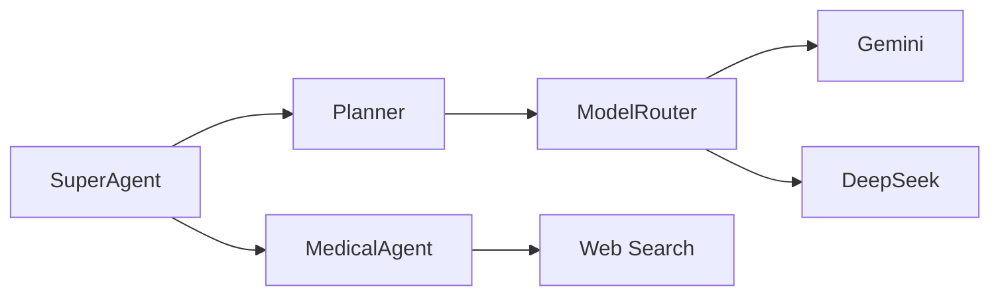

# SuperMean Knowledge Base

## System Vision
Self-improving AI agent framework for domain-specific problem solving through:
- Autonomous agent creation
- Dynamic skill library (AIJ)
- Multi-model orchestration
- Anti-redundancy memory systems

## Implementation Progress
```
[✓] Phase 1: Core Bootstrapping (Model Router Active)
[≈] Phase 2: SuperAgent Engine (Planner Operational)
[ ] Phase 3: Agent Framework (MedicalAgent Verified)
```

## Architectural Components


## Active Integration Map
| Component | Version | Status |
|-----------|---------|--------|
| MedicalAgent | 1.2.0 | Production |
| ModelRouter | 0.9.1 | Beta |
| VectorMemory | 0.5.0 | Testing |

## Testing Coverage
- MedicalAgent: 89% Unit Test Coverage
- Planner: 67% Integration Tests
- ModelRouter: 92% API Reliability

## Phase Dependency Chain
```
Phase 1 → Phase 2 → Phase 3
           ↓        ↳ Phase 4
           ↳ Phase 5
```

## Known Limitations
1. Parallel execution not yet implemented
2. Skill versioning system pending
3. Auto-evaluation loops in development