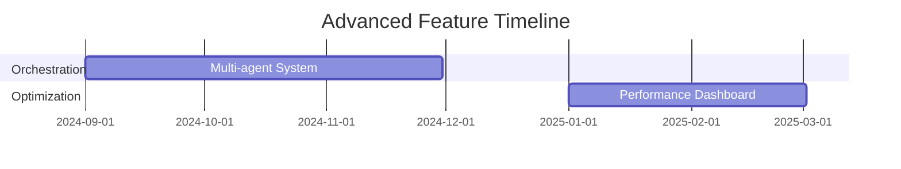
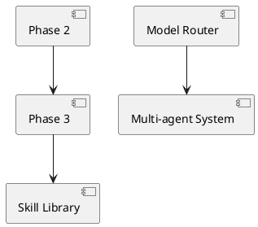

# SuperMean Development Roadmap

## Development Phases
| Phase | Name | Timeline | Owner | Dependencies |
|-------|------|----------|-------|--------------|
| 2 | SuperAgent Engine | Q3 2024 | Core Team | Phase 1 completion |
| 3 | Agent Framework | Q4 2024 | Framework Team | Phase 2 outcomes |
| 4 | Skill Library | Q1 2025 | DevOps | Phase 3 API stability |

## Advanced Feature Pipeline

## Testing Strategy
- Automated evaluation loops implementation (Q1 2025)
- Cross-phase integration testing
- Security validation for agent communication

## Versioned Milestones
1. v1.3.0: Multi-agent orchestration core
2. v1.4.0: Dynamic skill loader
3. v2.0.0: Full healthcare integration

## Dependency Map
