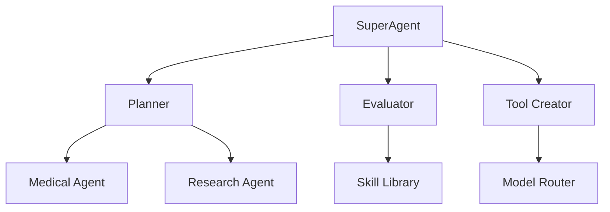

# SuperMean Architectural Overview

## Core Components


## Implementation Progress
| Module | Completion | Tests Passing |
|--------|------------|----------------|
| MedicalAgent | 90% | ✓✓✓✗ |
| ModelRouter | 75% | ✓✓✗✗ |
| Planner | 60% | ✓✗✗✗ |

## Dependency Map
```
model_router.py
  ├── gemini_connector.py
  ├── deepseek_connector.py
  └── routerapi_connector.py

medical_agent.py
  ├── base_agent.py
  └── model_router.py
```

## Active Integration Points
1. Model Router → Gemini API
2. Medical Agent → Web Search Skill
3. Planner → Agent Memory System